<p align="center">
  <a href="https://github.com/onlineunknowns/ai-cognitive-brain">
    
  </a>
</p>

<p align="center">
  <a href="https://readme-typing-svg.herokuapp.com">
    
  </a>
</p>

<p align="center">
  
  
  
  
  
  
</p>

<p align="center">
  
  
  
  
  
  
</p>

<p align="center">
  
  
  
  
</p>

<p align="center">
  
  
  
  
</p>

---

<p align="center">
  
</p>

---

## 🌐 Vision

> *"To create the most advanced open-source cognitive architecture that mirrors the complexity, adaptability, and emergent intelligence of the biological brain."*

The **AI Cognitive Brain System** is not just another AI framework — it is a ground-up simulation of how biological intelligence actually works. Built on principles from computational neuroscience, cognitive psychology, and systems engineering, this project models the brain as a living, dynamic network of interacting subsystems: cortex, synapses, memory, emotions, reward, motor control, and self-awareness.

Unlike conventional deep-learning pipelines that treat AI as a black box, this system exposes every cognitive layer as a modular, inspectable, and reconfigurable component. Engineers can tune the reward sensitivity of the dopamine engine, adjust the fear threshold of the emotional layer, or rewire the motor planning modules for robotic embodiment — all through a clean REST API and real-time WebSocket interface.

This architecture powers autonomous agents capable of long-term goal pursuit, contextual emotional reasoning, episodic memory recall, risk-aware decision making, and physical robot actuation — forming the cognitive backbone for next-generation autonomous systems.

---

## ✨ Core Features

- 🧠 **Multi-Layer Brain Simulation** — Cortex, Synapse Engine, Emotional Layer, Memory System, Reward Layer, Motor Layer, Awareness Layer all operating in parallel
- ⚡ **Real-Time Synapse Signal Propagation** — Neural signals fire, decay, and reinforce across a weighted graph architecture at millisecond resolution
- 💾 **Quad-Memory Architecture** — Short-term, long-term, episodic, and working memory with LRU eviction, consolidation cycles, and semantic indexing
- 🎯 **Dopamine-Driven Reward Engine** — Biological dopamine simulation with anticipation peaks, reward delivery curves, and habit formation loops
- 🎭 **5-Axis Emotional Engine** — Fear, Motivation, Happiness, Stress, and Curiosity modeled as continuous state vectors influencing every decision
- 🔍 **Attention Allocation System** — Priority-weighted focus distribution inspired by human selective attention and cognitive load theory
- 🤔 **Risk-Aware Decision Engine** — Multi-objective evaluation combining expected reward, risk estimate, emotional bias, and temporal discounting
- 🦾 **Robotics Motor Controller** — High-level cognitive commands translate to joint-level motor sequences with proprioceptive feedback loops
- 🪞 **Self-Awareness Introspection Layer** — The system monitors its own internal states, detects anomalies, and adjusts behavior meta-cognitively
- 🌐 **FastAPI + WebSocket Backend** — Full async REST API with real-time brain state streaming
- 🐳 **Docker-First Deployment** — Single-command deployment with Redis, workers, and brain services fully orchestrated
- 📊 **Live Benchmark Dashboard** — Real-time metrics for response time, memory load, signal speed, and decision latency

---

## 🏗️ Brain Architecture

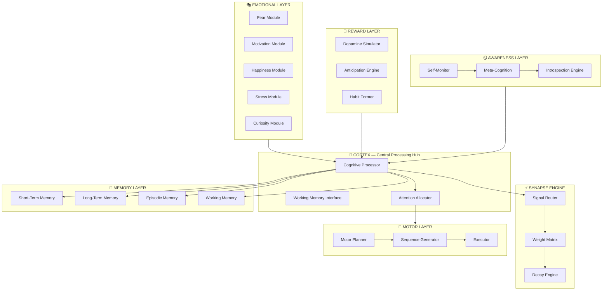

---

## ⚡ Synapse Engine

The Synapse Engine is the neural transmission backbone of the system. Every cognitive event — a memory recall, an emotional trigger, a decision impulse — travels as a weighted signal through the synapse graph. Signals are routed through dynamically weighted connections, decay over time following exponential curves mimicking biological synaptic fatigue, and are reinforced through Hebbian learning: *"neurons that fire together, wire together."*

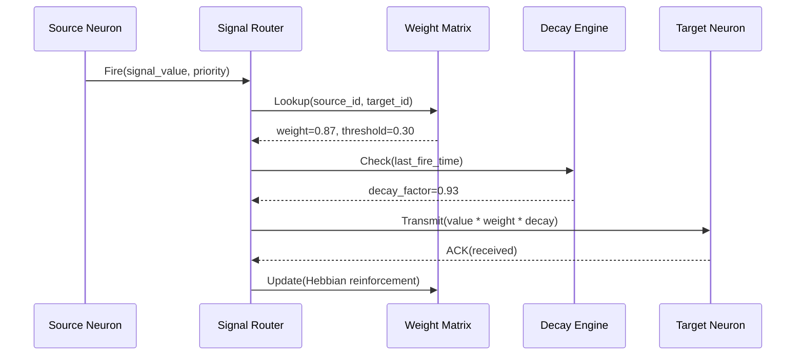

---

## 💾 Memory System

Memory in the cognitive brain operates across four distinct stores, each with unique properties, lifetimes, and retrieval mechanics:

- **Short-Term Memory (STM)** — Fast, volatile, capacity-limited buffer (Miller's 7±2 rule). Holds the most recent context window for immediate processing. Auto-evicts via LRU when capacity is exceeded.
- **Long-Term Memory (LTM)** — Persistent semantic storage backed by SQLite. Information is consolidated from STM during idle cycles, indexed by semantic embedding for fast associative retrieval.
- **Episodic Memory** — Timestamped autobiographical events stored as (context, action, outcome) tuples. Powers experience-based reasoning and analogical problem-solving.
- **Working Memory** — The active "scratchpad" for ongoing cognitive tasks. Integrates inputs from STM, LTM, and Episodic stores into a coherent present-moment context.

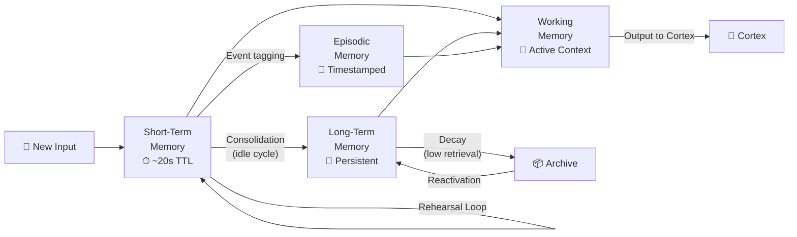

---

## 🎯 Reward System

The Reward System simulates dopaminergic pathways to drive motivated behavior. Unlike simple reinforcement signals, this engine models the full biological dopamine curve: anticipatory peaks before expected rewards, delivery responses at reward receipt, and depression dips when expected rewards fail to materialize.

Over time, repeated reward-action associations crystallize into habits, shifting behavior from deliberative decision-making to fast, automatic execution — exactly as observed in basal ganglia function.

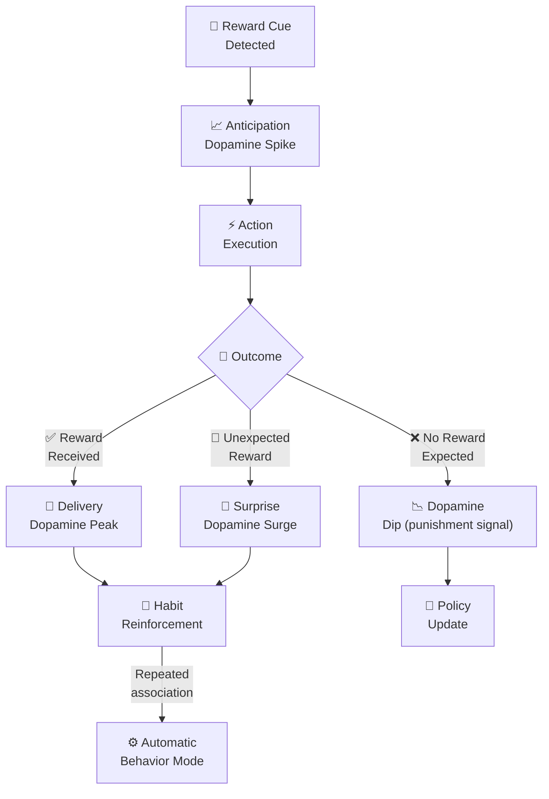

---

## 🎭 Emotional Engine

The Emotional Engine maintains a 5-dimensional continuous emotional state vector that modulates every cognitive process — from attention allocation to risk tolerance to motor speed. Each dimension is computed from incoming stimuli, memory activations, and current physiological state.

- **Fear** — Elevates risk aversion, redirects attention to threats, triggers adrenaline override at high intensities
- **Motivation** — Boosts goal-directed behavior, increases dopamine sensitivity, sustains long-horizon planning
- **Happiness** — Broadens exploration radius, increases social engagement, reduces stress reactivity
- **Stress** — Narrows attention, degrades working memory capacity, accelerates decision thresholds
- **Curiosity** — Drives information-seeking behavior, increases novelty weighting in decision making

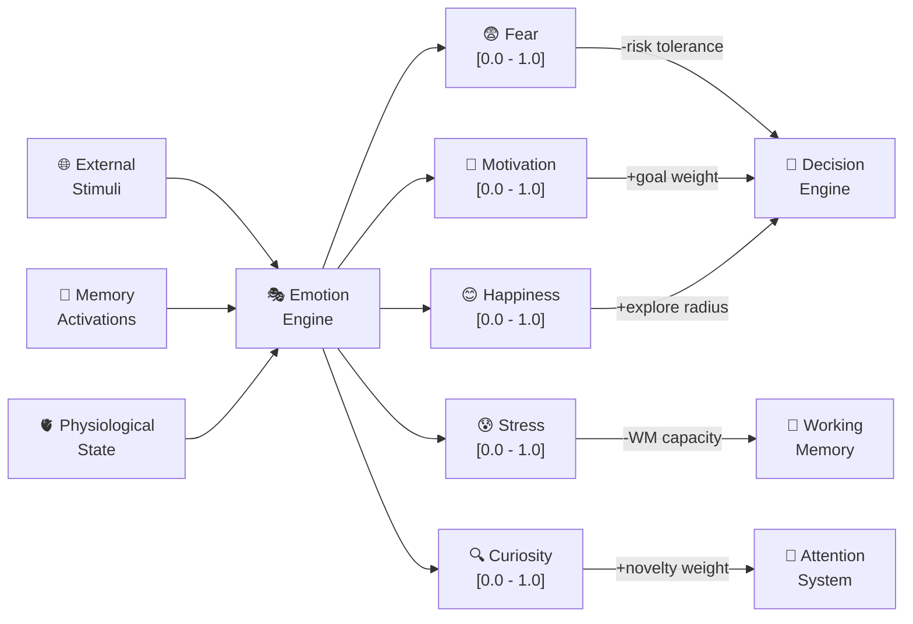

---

## 🎯 Attention System

The Attention System allocates the system's finite cognitive bandwidth across competing inputs and internal signals. Inspired by the spotlight model of human attention, it assigns priority scores based on emotional salience, goal relevance, temporal urgency, and novelty. The system dynamically shifts focus as new stimuli arrive, while sustaining baseline monitoring on background tasks.

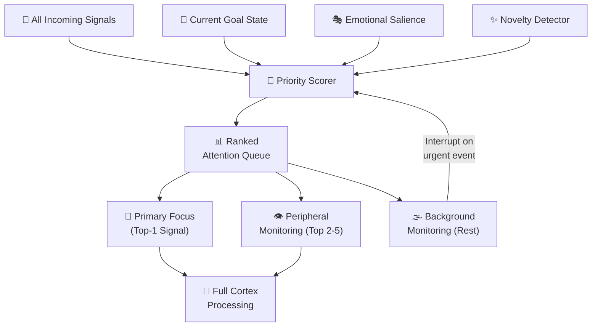

---

## 🤔 Decision Engine

The Decision Engine synthesizes outputs from all brain subsystems to select and commit to actions. It operates in a continuous evaluate-commit-execute loop, weighing expected reward against estimated risk, modulating both by the current emotional state, and discounting future outcomes by temporal distance.

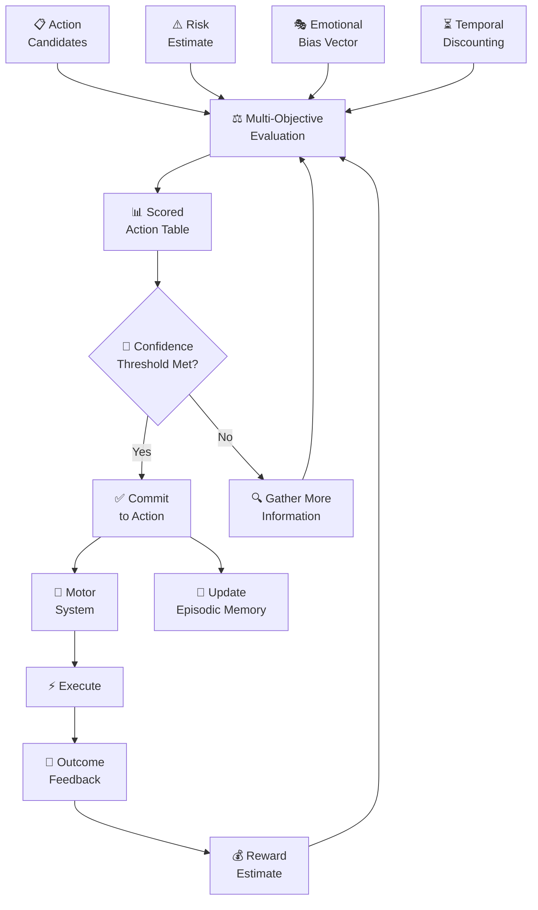

---

## 🦾 Robot Motor System

The Motor System bridges high-level cognitive decisions with physical world actuation. Cognitive commands (e.g., "move to target", "grasp object") are decomposed into joint-level motor sequences, validated against physical constraints, and dispatched to hardware actuators. Proprioceptive feedback continuously updates the motor planner to correct trajectory deviations.

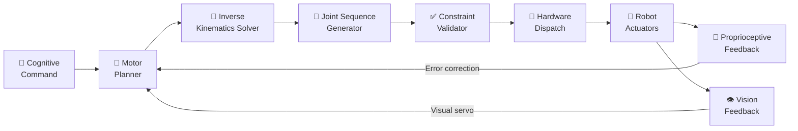

---

## 🪞 Self-Awareness Layer

The Self-Awareness Layer is the metacognitive supervisor of the entire system. It continuously monitors internal state metrics — memory load, emotional intensity, signal latency, decision confidence, motor error rates — and detects anomalous patterns. When irregularities are detected, it triggers adaptive recalibration: adjusting attention thresholds, flushing corrupted memory segments, modulating emotional sensitivity, or requesting human oversight.

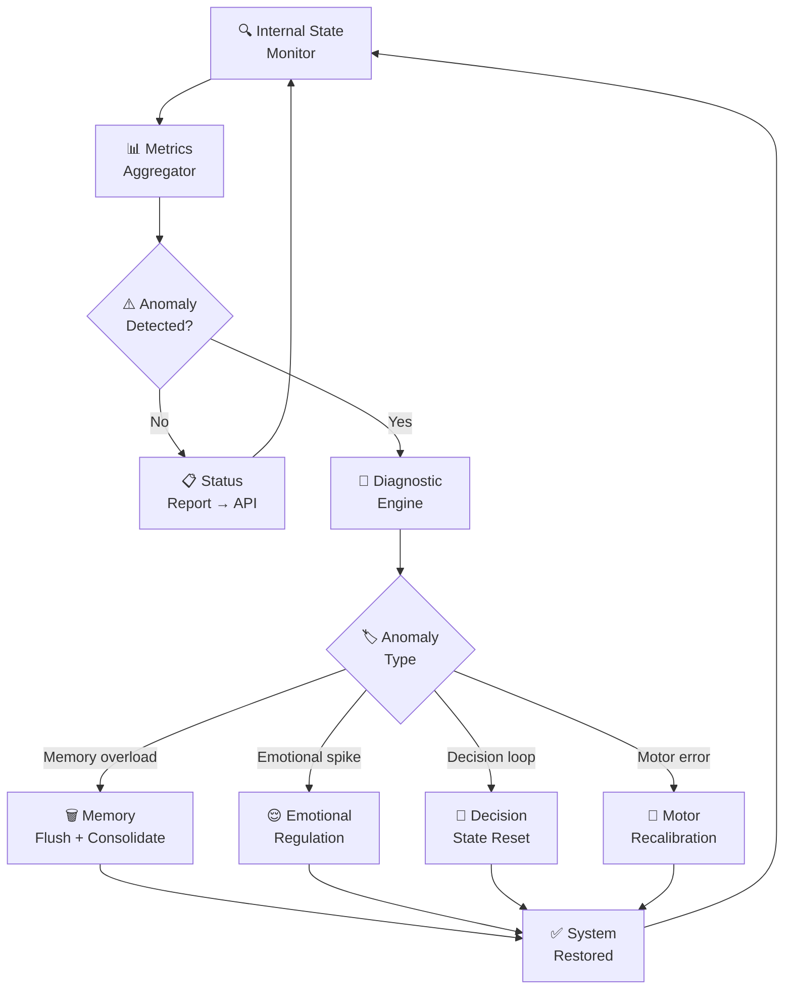

---

## 🗺️ Architecture Maps

### 1. Complete Brain Architecture

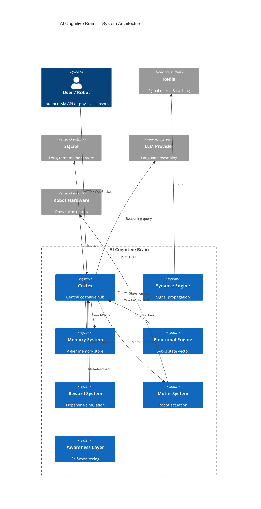

### 2. Startup Flow

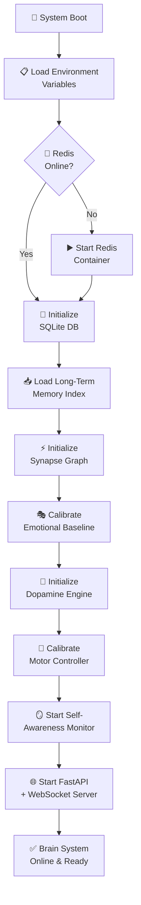

### 3. Neural Signal Propagation

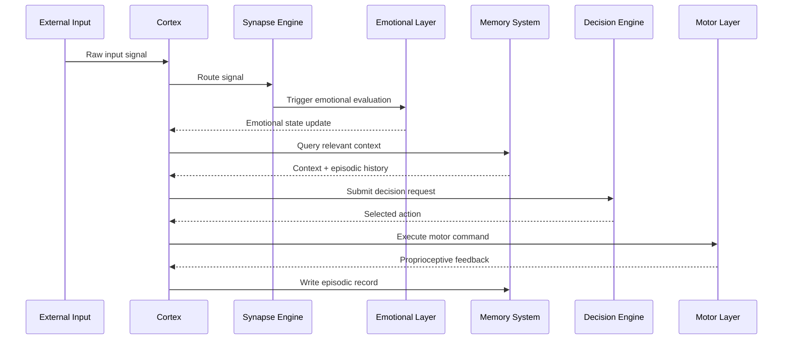

### 4. Dopamine Reward Cycle (Detailed)

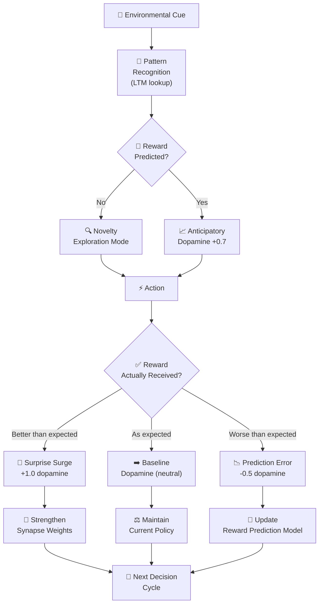

### 5. Adrenaline Emergency Override

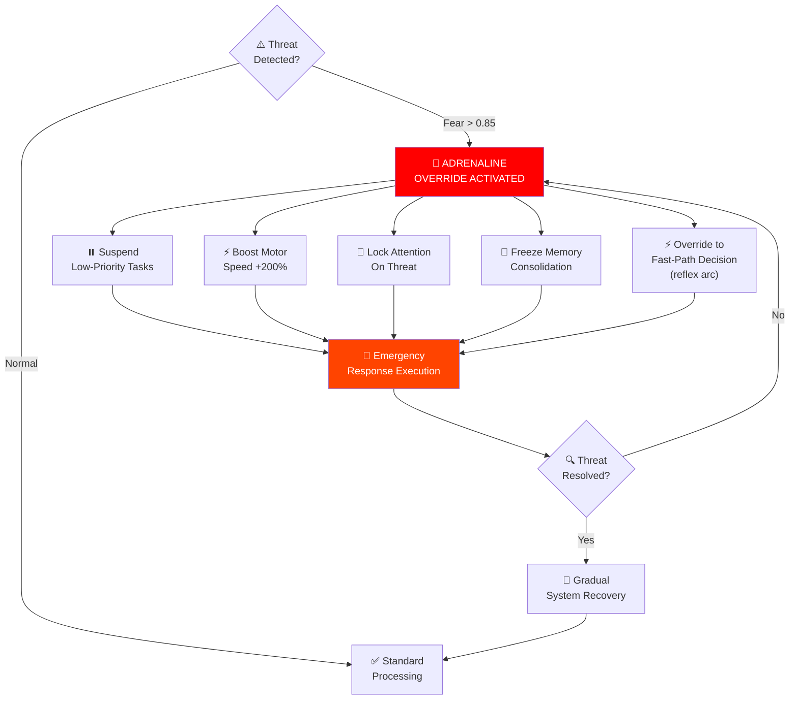

---

## ⚙️ Installation Guide

```bash
# 1. Clone the repository
git clone https://github.com/onlineunknowns/ai-cognitive-brain.git
cd ai-cognitive-brain

# 2. Create and activate virtual environment
python -m venv venv
source venv/bin/activate          # Linux/macOS
# venv\Scripts\activate           # Windows

# 3. Install dependencies
pip install -r requirements.txt

# 4. Configure environment
cp .env.example .env
nano .env  # Set LLM_API_KEY, REDIS_URL, SECRET_KEY etc.

# 5. Initialize database
python -m backend.db.init_db

# 6. Start the system
python -m backend.main
```

---

## 💻 System Requirements

| Component | Minimum | Recommended |
|-----------|---------|-------------|
| **Python** | 3.11+ | 3.12+ |
| **RAM** | 4 GB | 16 GB |
| **CPU** | 4 cores | 8+ cores |
| **GPU** | *(Optional)* | NVIDIA 8GB+ VRAM |
| **Storage** | 10 GB | 50 GB SSD |
| **Redis** | 7.x | 7.2+ |
| **OS** | Linux / macOS | Ubuntu 22.04 LTS |

---

## 🚀 Run Instructions

```bash
# Terminal 1 — Start Redis
redis-server --port 6379

# Terminal 2 — Start background workers
python -m backend.workers.synapse_worker &
python -m backend.workers.memory_worker &
python -m backend.workers.reward_worker &

# Terminal 3 — Start the main brain API server
uvicorn backend.main:app --host 0.0.0.0 --port 8000 --reload

# Terminal 4 — Monitor brain state (optional)
python -m backend.tools.brain_monitor
```

---

## 🐳 Docker Deployment

### Dockerfile

```dockerfile
FROM python:3.12-slim

WORKDIR /app

RUN apt-get update && apt-get install -y \
    build-essential \
    libsqlite3-dev \
    && rm -rf /var/lib/apt/lists/*

COPY requirements.txt .
RUN pip install --no-cache-dir -r requirements.txt

COPY . .

RUN python -m backend.db.init_db

EXPOSE 8000

CMD ["uvicorn", "backend.main:app", "--host", "0.0.0.0", "--port", "8000"]
```

### docker-compose.yml

```yaml
version: "3.9"

services:
  redis:
    image: redis:7-alpine
    ports:
      - "6379:6379"
    volumes:
      - redis_data:/data
    healthcheck:
      test: ["CMD", "redis-cli", "ping"]
      interval: 10s
      timeout: 5s
      retries: 5

  brain:
    build: .
    ports:
      - "8000:8000"
    environment:
      - REDIS_URL=redis://redis:6379/0
      - SECRET_KEY=${SECRET_KEY}
      - LLM_API_KEY=${LLM_API_KEY}
      - LLM_MODEL=${LLM_MODEL:-gpt-4o}
    volumes:
      - brain_data:/app/data
    depends_on:
      redis:
        condition: service_healthy

  synapse_worker:
    build: .
    command: python -m backend.workers.synapse_worker
    environment:
      - REDIS_URL=redis://redis:6379/0
    depends_on:
      - redis
      - brain

  memory_worker:
    build: .
    command: python -m backend.workers.memory_worker
    environment:
      - REDIS_URL=redis://redis:6379/0
    depends_on:
      - redis
      - brain

volumes:
  redis_data:
  brain_data:
```

```bash
# Build and launch
docker-compose up --build -d

# Check status
docker-compose ps

# View brain logs
docker-compose logs -f brain

# Stop everything
docker-compose down
```

---

## 📡 API Endpoints

### Brain State

| Method | Endpoint | Description |
|--------|----------|-------------|
| `GET` | `/api/v1/brain/status` | Full brain system status |
| `GET` | `/api/v1/brain/state` | Current cognitive state snapshot |
| `POST` | `/api/v1/brain/reset` | Reset brain to baseline state |
| `WS` | `/ws/brain/stream` | Real-time brain state stream |

### Cognitive Input

| Method | Endpoint | Description |
|--------|----------|-------------|
| `POST` | `/api/v1/input/text` | Submit text input to cortex |
| `POST` | `/api/v1/input/sensory` | Submit raw sensory data |
| `POST` | `/api/v1/input/event` | Submit structured event |

### Memory

| Method | Endpoint | Description |
|--------|----------|-------------|
| `GET` | `/api/v1/memory/short-term` | Retrieve STM contents |
| `GET` | `/api/v1/memory/long-term` | Query LTM by keyword |
| `GET` | `/api/v1/memory/episodic` | Retrieve episodic history |
| `DELETE` | `/api/v1/memory/flush` | Flush short-term memory |

### Emotion & Reward

| Method | Endpoint | Description |
|--------|----------|-------------|
| `GET` | `/api/v1/emotion/state` | Current emotion vector |
| `POST` | `/api/v1/emotion/inject` | Inject emotional stimulus |
| `GET` | `/api/v1/reward/dopamine` | Current dopamine level |
| `POST` | `/api/v1/reward/deliver` | Deliver reward signal |

### Decision & Motor

| Method | Endpoint | Description |
|--------|----------|-------------|
| `POST` | `/api/v1/decision/evaluate` | Request decision evaluation |
| `GET` | `/api/v1/decision/last` | Last decision record |
| `POST` | `/api/v1/motor/command` | Submit motor command |
| `GET` | `/api/v1/motor/status` | Robot motor status |

---

## 🧪 Example Requests

### cURL — Submit Text Input

```bash
curl -X POST http://localhost:8000/api/v1/input/text \
  -H "Content-Type: application/json" \
  -H "Authorization: Bearer $API_KEY" \
  -d '{
    "text": "There is an obstacle 2 meters ahead.",
    "priority": 0.8,
    "source": "vision_sensor"
  }'
```

### Python — Query Emotional State

```python
import httpx

async def get_emotion_state():
    async with httpx.AsyncClient() as client:
        response = await client.get(
            "http://localhost:8000/api/v1/emotion/state",
            headers={"Authorization": f"Bearer {API_KEY}"}
        )
        state = response.json()
        print(f"Fear:       {state['fear']:.3f}")
        print(f"Motivation: {state['motivation']:.3f}")
        print(f"Happiness:  {state['happiness']:.3f}")
        print(f"Stress:     {state['stress']:.3f}")
        print(f"Curiosity:  {state['curiosity']:.3f}")
```

### JSON — Deliver Reward Signal

```json
POST /api/v1/reward/deliver
{
  "reward_value": 0.85,
  "reward_type": "task_completion",
  "context": {
    "action_id": "navigate_to_target_001",
    "expected_reward": 0.70,
    "surprise_factor": 0.15
  }
}
```

---

## 📁 Project Tree

```
ai-cognitive-brain/
│
├── backend/
│   ├── main.py                    # FastAPI app entry point
│   ├── config.py                  # Environment configuration
│   ├── dependencies.py            # DI container
│   │
│   ├── brain/
│   │   ├── cortex.py              # Central cognitive processor
│   │   ├── attention.py           # Attention allocator
│   │   └── awareness.py          # Self-awareness layer
│   │
│   ├── memory/
│   │   ├── short_term.py          # STM buffer
│   │   ├── long_term.py           # LTM SQLite store
│   │   ├── episodic.py            # Episodic memory
│   │   └── working.py             # Working memory
│   │
│   ├── emotion/
│   │   ├── engine.py              # Emotion state machine
│   │   ├── fear.py                # Fear module
│   │   ├── motivation.py          # Motivation module
│   │   ├── happiness.py           # Happiness module
│   │   ├── stress.py              # Stress module
│   │   └── curiosity.py           # Curiosity module
│   │
│   ├── reward/
│   │   ├── dopamine.py            # Dopamine simulator
│   │   ├── anticipation.py        # Anticipation engine
│   │   └── habit.py               # Habit formation
│   │
│   ├── robotics/
│   │   ├── motor_controller.py    # Motor command handler
│   │   ├── ik_solver.py           # Inverse kinematics
│   │   ├── sequence_gen.py        # Joint sequence generator
│   │   └── feedback.py            # Proprioceptive feedback
│   │
│   ├── decision/
│   │   ├── engine.py              # Decision evaluator
│   │   ├── risk_estimator.py      # Risk scoring
│   │   ├── reward_estimator.py    # Reward scoring
│   │   └── temporal.py            # Temporal discounting
│   │
│   ├── synapse/
│   │   ├── engine.py              # Signal propagation
│   │   ├── graph.py               # Synapse weight graph
│   │   └── decay.py               # Signal decay model
│   │
│   ├── api/
│   │   ├── routers/
│   │   │   ├── brain.py           # Brain endpoints
│   │   │   ├── input.py           # Input endpoints
│   │   │   ├── memory.py          # Memory endpoints
│   │   │   ├── emotion.py         # Emotion endpoints
│   │   │   ├── reward.py          # Reward endpoints
│   │   │   ├── decision.py        # Decision endpoints
│   │   │   └── motor.py           # Motor endpoints
│   │   └── websocket.py           # WebSocket stream handler
│   │
│   ├── models/
│   │   ├── brain_state.py         # Pydantic models
│   │   ├── memory_item.py
│   │   ├── emotion_state.py
│   │   └── motor_command.py
│   │
│   ├── db/
│   │   ├── database.py            # SQLite connection
│   │   ├── init_db.py             # Schema initialization
│   │   └── migrations/            # DB migrations
│   │
│   ├── workers/
│   │   ├── synapse_worker.py      # Async synapse processor
│   │   ├── memory_worker.py       # Memory consolidation worker
│   │   └── reward_worker.py       # Reward cycle worker
│   │
│   └── tools/
│       └── brain_monitor.py       # CLI monitoring tool
│
├── tests/
│   ├── test_cortex.py
│   ├── test_memory.py
│   ├── test_emotion.py
│   ├── test_reward.py
│   ├── test_decision.py
│   └── test_motor.py
│
├── docker/
│   ├── Dockerfile
│   └── docker-compose.yml
│
├── .env.example
├── requirements.txt
├── README.md
└── LICENSE
```

---

## 🖥️ Terminal Simulation

```
╔══════════════════════════════════════════════════════════════╗
║           AI COGNITIVE BRAIN SYSTEM v1.0.0                   ║
║           Neural Intelligence Engine — Boot Sequence         ║
╚══════════════════════════════════════════════════════════════╝

[00:00.001]  🔴 Checking Redis connection......... ✅ ONLINE (127.0.0.1:6379)
[00:00.012]  💾 Initializing SQLite database...... ✅ READY (brain.db, 847 records)
[00:00.045]  📥 Loading LTM index................. ✅ LOADED (12,847 embeddings)
[00:00.089]  ⚡ Initializing Synapse Graph........ ✅ BUILT (4,320 nodes, 18,940 edges)
[00:00.112]  🎭 Calibrating Emotional Baseline.... ✅ NEUTRAL (fear=0.10, mot=0.50)
[00:00.134]  🎯 Initializing Dopamine Engine...... ✅ READY (baseline=0.45)
[00:00.167]  🦾 Calibrating Motor Controller...... ✅ READY (6-DOF, 0 errors)
[00:00.203]  🪞 Starting Awareness Monitor........ ✅ WATCHING (interval=100ms)
[00:00.251]  🌐 Starting FastAPI Server........... ✅ LIVE (0.0.0.0:8000)
[00:00.252]  📡 WebSocket Stream Active........... ✅ /ws/brain/stream
[00:00.253]
[00:00.253]  ╔══════════════════════════════════════╗
[00:00.253]  ║  🧠 BRAIN SYSTEM ONLINE & READY ✅  ║
[00:00.253]  ╚══════════════════════════════════════╝
[00:00.253]
[00:00.300]  [SYNAPSE]   Signal propagation active — 0 pending
[00:00.350]  [MEMORY]    Consolidation worker running
[00:00.400]  [REWARD]    Dopamine cycle active — period=500ms
[00:01.000]  [CORTEX]    Awaiting input...
```

---

## 📊 Benchmark

| Metric | Value | Condition |
|--------|-------|-----------|
| **API Response Time** | < 12ms | Simple query, local Redis |
| **Decision Latency** | < 45ms | Full decision cycle, 10 candidates |
| **Memory Write (STM)** | < 2ms | In-memory |
| **Memory Retrieval (LTM)** | < 18ms | SQLite + embedding index |
| **Synapse Signal Speed** | < 8ms | 4,320-node graph traversal |
| **Emotion State Update** | < 1ms | Vector arithmetic |
| **WebSocket Broadcast** | < 5ms | Brain state stream |
| **Memory Consolidation** | ~200ms | STM → LTM batch (50 items) |
| **Docker Cold Start** | ~4.2s | All services |
| **RAM Usage (idle)** | ~180 MB | No active sessions |
| **RAM Usage (active)** | ~480 MB | Full cognition, 1 agent |

---

<details>
<summary>🔬 Technical Deep Dive — Synapse Engine Internals</summary>

### Graph Architecture

The Synapse Engine represents the brain as a directed weighted graph `G = (V, E, W)` where:
- `V` = neuron nodes (memory units, emotional registers, decision nodes)
- `E` = directed connections between nodes
- `W` = weight matrix updated via Hebbian learning

Signal propagation uses a modified Bellman-Ford algorithm with decay factors applied at each hop. The decay function follows biological synaptic fatigue: `signal_t = signal_0 * e^(-λt)` where λ is the synapse-specific decay constant.

### Hebbian Learning Rule

Weight updates follow the rule: `Δw_ij = η * a_i * a_j` where `η` is the learning rate, `a_i` and `a_j` are the activation levels of pre- and post-synaptic neurons. This causes frequently co-activated pathways to strengthen over time — the computational basis of habit formation.

### Signal Queue

All signals are enqueued in Redis as priority-sorted tasks. The Synapse Worker polls the queue at 1ms intervals, batches signals by destination node, and applies the full propagation algorithm. This architecture allows horizontal scaling of signal processing workers without any shared mutable state.

</details>

<details>
<summary>🧠 Technical Deep Dive — Memory Architecture</summary>

### Short-Term Memory (STM)

Implemented as an `OrderedDict` with a configurable capacity (default: 7 items, per Miller's Law). Each entry carries a TTL of 20 seconds (configurable). On capacity overflow, the least-recently-used item is evicted and forwarded to the Memory Worker for LTM consolidation evaluation.

### Long-Term Memory (LTM)

Uses SQLite with a vector extension (sqlite-vss) for semantic similarity search. Every memory item is embedded using a sentence-transformer model (`all-MiniLM-L6-v2`) at write time. Retrieval supports both exact-match keyword queries and approximate nearest-neighbor semantic search with configurable similarity thresholds.

### Episodic Memory

Stored as `(timestamp, context_embedding, action_id, outcome_score, emotional_state)` tuples. At decision time, the Decision Engine queries the top-5 most similar past episodes to inform risk estimates and reward predictions — a form of case-based reasoning.

</details>

<details>
<summary>🎭 Technical Deep Dive — Emotional Engine</summary>

### State Representation

The emotional state is a 5-dimensional continuous vector `E = [fear, motivation, happiness, stress, curiosity]` where each dimension lives in `[0.0, 1.0]`. The vector is updated on every incoming stimulus via a weighted blend: `E_new = α * E_stimulus + (1-α) * E_current` where `α` is the emotional inertia coefficient (default: 0.15) — preventing wild swings from single stimuli.

### Cross-Dimensional Coupling

Dimensions are not independent. The coupling matrix defines interactions:
- High stress → suppresses curiosity and happiness
- High fear → elevates stress
- High motivation → reduces fear sensitivity
- High curiosity → boosts motivation

These couplings are applied after each update cycle, making the emotional system exhibit realistic emergent dynamics.

</details>

<details>
<summary>🤔 Technical Deep Dive — Decision Engine</summary>

### Multi-Objective Scoring

Each candidate action is scored as: `score = w_r * R̂ - w_k * K̂ + w_e * E_bias + w_t * T_discount`

Where `R̂` is the predicted reward (from episodic memory), `K̂` is the estimated risk (from risk module), `E_bias` is the emotional modulation (e.g., high fear adds risk aversion), and `T_discount` applies a hyperbolic discount for delayed rewards.

### Confidence Gating

Before committing to an action, the engine checks if the top-scored action exceeds a confidence threshold (default: 0.65). If not, the system requests more information — querying memory, sensors, or the LLM provider for additional context — before re-evaluating.

</details>

---

## 🤖 Future Robotics Integration

The cognitive brain is designed from the ground up for physical embodiment. Planned hardware integrations include:

- **Multi-Modal Sensors** — Camera arrays (RGB-D), LiDAR, IMU, force/torque sensors feeding the sensory cortex
- **Servo/Motor Control** — ROS 2 integration for 6-DOF manipulators and mobile bases via the Motor Layer
- **Computer Vision** — YOLO-based object detection + semantic segmentation feeding the Attention and Memory systems
- **Speech I/O** — Whisper STT + TTS pipeline for natural language interface to the cognitive system
- **Haptic Feedback** — Tactile sensor arrays updating the proprioceptive feedback loop in real-time

---

## 🗓️ AI Cognition Roadmap

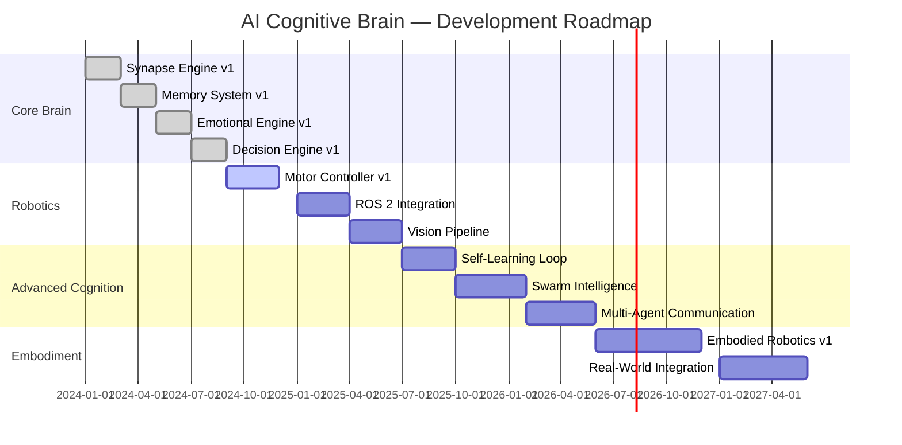

---

## 🌅 Future Development

- **Swarm Intelligence** — Multi-agent brain instances communicating via a shared Redis pub/sub bus, enabling emergent collective intelligence
- **Multi-Agent Communication Protocol** — Standardized cognitive message format for brain-to-brain signal exchange in multi-robot systems
- **Embodied Robotics** — Full ROS 2 embodiment with closed-loop sensorimotor integration
- **Real-World Integration** — Production deployment on physical robotic platforms with safety-critical override systems
- **Self-Learning Loop** — Online reinforcement learning from real-world interaction, updating synapse weights and reward models continuously
- **Autonomous Adaptation** — Meta-learning layer allowing the brain to modify its own architecture in response to new task domains

---

## 🚢 Deployment Options

| Platform | Command | Notes |
|----------|---------|-------|
| **Local** | `uvicorn backend.main:app` | Development mode |
| **Docker** | `docker-compose up -d` | Production ready |
| **Cloud (AWS)** | ECS + ElastiCache Redis | Scalable, managed |
| **Kubernetes** | `kubectl apply -f k8s/` | Multi-replica HA |
| **Edge Devices** | Jetson Nano / Raspberry Pi 5 | Robotics deployment |

---

## 🤝 Contribution Guide

We welcome contributions from researchers, engineers, and AI enthusiasts!

1. **Fork** the repository and create a feature branch: `git checkout -b feat/your-feature`
2. **Write tests** for every new brain module in `tests/`
3. **Follow** the code style: `black .` + `ruff check .`
4. **Document** all public APIs with docstrings
5. **Submit** a Pull Request with a clear description of the cognitive capability added
6. **Reference** any relevant neuroscience papers in comments where applicable

For major architectural changes, please open an Issue first to discuss the design with maintainers.

---

## 📄 License

```
MIT License

Copyright (c) 2024 Online Unknowns

Permission is hereby granted, free of charge, to any person obtaining a copy
of this software and associated documentation files (the "Software"), to deal
in the Software without restriction, including without limitation the rights
to use, copy, modify, merge, publish, distribute, sublicense, and/or sell
copies of the Software, and to permit persons to whom the Software is
furnished to do so, subject to the following conditions:

The above copyright notice and this permission notice shall be included in all
copies or substantial portions of the Software.
```

---

<p align="center">
  
</p>

<p align="center">
  <strong>Built with 🧠 by <a href="https://github.com/onlineunknowns">Online Unknowns</a></strong>
</p>

<p align="center">
  <a href="https://buymeacoffee.com/onlineunknowns">
    
  </a>
  &nbsp;
  <a href="https://wa.me/201286669272">
    
  </a>
  &nbsp;
  
</p>

<p align="center">
  <em>If this project helped you, please ⭐ star the repository!</em>
</p>
