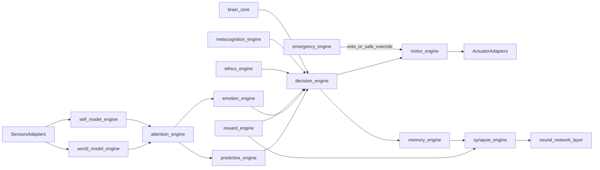
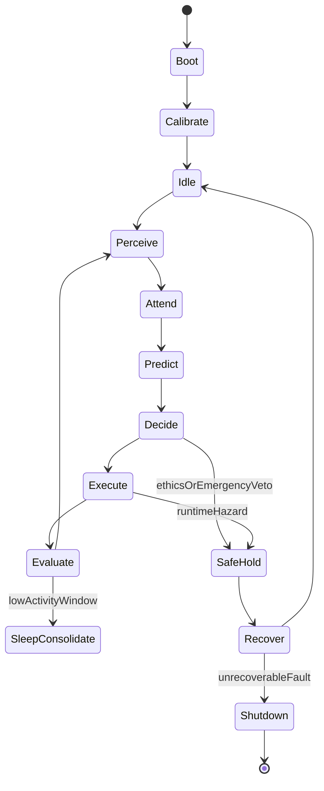

# System Design Specification

## Module Interaction Map

## API Design (Internal Contracts)

- `PerceptionAPI`: `ingestSensorFrame`, `getWorldState`
- `AttentionAPI`: `computePrioritySet`, `getFocusContext`
- `DecisionAPI`: `proposeActions`, `evaluateActions`, `commitAction`
- `MotorAPI`: `planTrajectory`, `executeCommand`, `abortCommand`
- `MemoryAPI`: `storeTrace`, `recallByCue`, `consolidateBatch`
- `RewardAPI`: `computeReward`, `applyCreditAssignment`
- `SafetyAPI`: `evaluateConstraint`, `triggerEmergencyStop`

## Class Design (Conceptual)

- `BrainCoreOrchestrator`
- `ModuleContext`
- `NeuronGraphExecutor`
- `SynapticPlasticityManager`
- `MemoryManager`
- `DecisionArbiter`
- `EmotionStateController`
- `AttentionController`
- `SafetySupervisor`
- `MotorSupervisor`

## Event System Design

- Typed envelopes defined in `interfaces/event_schemas.json`
- channel priorities:
  - `critical`: safety and watchdog
  - `realtime`: perception-decision-motor
  - `background`: consolidation and analytics
- delivery:
  - exactly-once intent for critical path
  - at-least-once for background
- replay and dead-letter handling in state-store and bus adapters

## Cognitive State Machine

## Execution Lifecycle

1. boot and load policy/model versions
2. calibrate sensors and establish self-state baseline
3. run continuous cognitive loop
4. update memory/synapse/reward learning signals per action outcome
5. preempt command flow on ethics or emergency veto
6. consolidate and prune memory during low-activity windows
7. persist snapshots and replayable events for fault recovery
